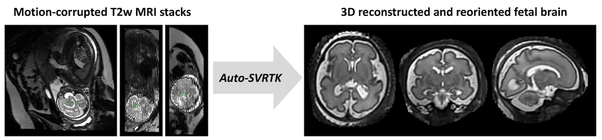
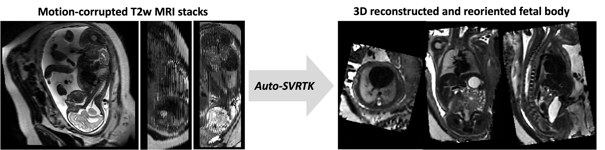

Scripts for automated SVRTK processing dockers 
====================

This repository contains the pipelines for [MONAI](https://github.com/Project-MONAI/MONAI)-based automated fetal MRI analysis [SVRTK dockers](https://hub.docker.com/r/fetalsvrtk/svrtk).


- The repository and code for automation of [SVR](https://github.com/SVRTK/SVRTK) reconstruction and deep learning segmentation were designed and created by [Alena Uus](https://github.com/alenauus).







The auto pipelines are used in:

- Integration via AIDE led by [Tom Roberts](https://github.com/tomaroberts): https://github.com/SVRTK/aide-svrtk

- Integration via Gadgetron led by [Sara Neves Silva](https://github.com/saranevessilva): https://github.com/SVRTK/gadgetron-svrtk-integration


Development of SVRTK was supported by projects led by Prof Mary Rutherford, Dr Lisa Story, Dr Maria Deprez, Dr Jana Hutter and Prof Jo Hajnal.


Auto processing 
---------------


**The automated SVRTK docker tag is _fetalsvrtk/svrtk:general_auto_amd_**


**AUTOMATED 3D T2w BRAIN / BODY RECONSTRUCTION:**

*Input data requirements:*
- more than 5-6 stacks
- full ROI coverage in all stacks
- 21-40 weeks GA
- no extreme shading artifacts
- singleton pregnancy
- 0.55 / 1.5 / 3T
- 80 – 180ms TE
- sufficient SNR and image quality

*Output:*
- 0.8mm resolution (or as specified)
- Standard radiological space

```bash

docker pull fetalsvrtk/svrtk:general_auto_amd

docker run --rm  --mount type=bind,source=LOCATION_ON_YOUR_MACHINE,target=/home/data  fetalsvrtk/svrtk:general_auto_amd sh -c ' bash /home/auto-proc-svrtk/scripts/auto-body-reconstruction.sh /home/data/folder-with-files /home/data/out-body-recon-results 1 3.0 0.8 1 ; '

docker run --rm  --mount type=bind,source=LOCATION_ON_YOUR_MACHINE,target=/home/data  fetalsvrtk/svrtk:general_auto_amd sh -c ' bash /home/auto-proc-svrtk/scripts/auto-brain-reconstruction.sh /home/data/folder-with-files /home/data/out-brain-recon-results 1 3.0 0.8 1 ; ' 

```

**AUTOMATED 3D T2w BRAIN / BODY SEGMENTATION:**


*Input data requirements:*
- sufficient SNR and image quality
- full ROI coverage
- good quality 3D SVR / DSVR reconsruction
- reorientation to the standard radiological atlas space
- 21-38 weeks GA
- no extreme shading artifacts
- no extreme structural anomalies
- 0.55 / 1.5 / 3T
- 80 – 250ms TE


```bash

docker pull fetalsvrtk/svrtk:general_auto_amd

docker run --rm  --mount type=bind,source=LOCATION_ON_YOUR_MACHINE,target=/home/data  fetalsvrtk/svrtk:general_auto_amd sh -c ' bash /home/auto-proc-svrtk/scripts/auto-brain-bounti-segmentation-fetal.sh /home/data/your_folder_with_brain_svr_t2_files  /home/data/output_folder_for_segmentations ; '

docker run --rm  --mount type=bind,source=LOCATION_ON_YOUR_MACHINE,target=/home/data  fetalsvrtk/svrtk:general_auto_amd sh -c ' bash /home/auto-proc-svrtk/scripts/auto-brain-bet-segmentation-fetal.sh /home/data/your_folder_with_brain_svr_t2_files  /home/data/output_folder_for_segmentations ; '

docker run --rm  --mount type=bind,source=LOCATION_ON_YOUR_MACHINE,target=/home/data  fetalsvrtk/svrtk:general_auto_amd sh -c ' bash /home/auto-proc-svrtk/scripts/auto-body-organ-segmentation.sh /home/data/your_folder_with_body_dsvr_t2_files  /home/data/output_folder_for_segmentations ; ' 

```

**AUTOMATED REORIENTATION OF 3D T2w BRAIN / BODY RECONS TO STANDARD SPACE:**


*Input data requirements:*
- sufficient SNR and image quality
- full ROI coverage
- no extreme shading artifacts
- no extreme structural anomalies
- 0.55 / 1.5 / 3T
- 80 – 250ms TE


```bash

docker pull fetalsvrtk/svrtk:general_auto_amd

docker run --rm  --mount type=bind,source=LOCATION_ON_YOUR_MACHINE,target=/home/data  fetalsvrtk/svrtk:general_auto_amd sh -c ' bash /home/auto-proc-svrtk/scripts/auto-brain-reorientation.sh /home/data/your_folder_with_brain_svr_t2_files  /home/data/output_folder_for_reoriented_images 0.5 1 0; '

docker run --rm  --mount type=bind,source=LOCATION_ON_YOUR_MACHINE,target=/home/data  fetalsvrtk/svrtk:general_auto_amd sh -c ' bash /home/auto-proc-svrtk/scripts/auto-body-reorientation.sh /home/data/your_folder_with_body_dsvr_t2_files  /home/data/output_folder_for_reoriented_images 0.5 1 0; '

```


License
-------

The auto SVRTK code and all scripts are distributed under the terms of the
[GNU General Public License v3.0](https://www.gnu.org/licenses/gpl-3.0.en.html). This program is free software: you can redistribute it and/or modify it under the terms of the GNU General Public License as published by the Free Software Foundation version 3 of the License. 

This software is distributed in the hope that it will be useful, but WITHOUT ANY WARRANTY; without even the implied warranty of MERCHANTABILITY or FITNESS FOR A PARTICULAR PURPOSE.  See the GNU General Public License for more details.


Citation and acknowledgements
-----------------------------

In case you found auto SVRTK useful please give appropriate credit to the software and [SVRTK dockers](https://hub.docker.com/r/fetalsvrtk/svrtk).

**Auto brain reconstruction (please include both citations):**
> Uus, A. U., Hall, M., Payette, K., Hajnal, J. V., Deprez, M., Hutter, J., Rutherford, M. A., Story, L. (2023) Combined quantitative T2* map and structural T2- weighted tissue-specific analysis for fetal brain MRI: pilot automated pipeline. PIPPI MICCAI 2023 workshop, LNCS 14246.: https://doi.org/10.1007/978-3-031-45544-5_3

> Kuklisova-Murgasova, M., Quaghebeur, G., Rutherford, M. A., Hajnal, J. V., & Schnabel, J. A. (2012). Reconstruction of fetal brain MRI with intensity matching and complete outlier removal. Medical Image Analysis, 16(8), 1550–1564.: https://doi.org/10.1016/j.media.2012.07.004

**Auto thorax/body reconstruction:**
> Uus, A., Grigorescu, I., van Poppel, M., Steinweg, J. K., Roberts, T., Rutherford, M., Hajnal, J., Lloyd, D., Pushparajah, K. & Deprez, M. (2022) Automated 3D reconstruction of the fetal thorax in the standard atlas space from motion-corrupted MRI stacks for 21-36 weeks GA range. Medical Image Analysis, 80 (August 2022).: https://doi.org/10.1016/j.media.2022.102484

**Brain tissue segmentation:**
> Uus, A. U., Kyriakopoulou, V., Makropoulos, A., Fukami-Gartner, A., Cromb, D., Davidson, A., Cordero-Grande, L., Price, A. N., Grigorescu, I., Williams, L. Z. J., Robinson, E. C., Lloyd, D., Pushparajah, K., Story, L., Hutter, J., Counsell, S. J., Edwards, A. D., Rutherford, M. A., Hajnal, J. V., Deprez, M. (2023) BOUNTI: Brain vOlumetry and aUtomated parcellatioN for 3D feTal MRI. eLife 12:RP88818; doi: https://doi.org/10.7554/eLife.88818.1

**Body organ segmentation:**
> Uus, A. U., Hall, M., Grigorescu, I., Avena Zampieri, C., Egloff Collado, A., Payette, K., Matthew, J., Kyriakopoulou, V., Hajnal, J. V., Hutter, J., Rutherford, M. A., Deprez, M., Story, L. (2023) 3D T2w fetal body MRI: automated organ volumetry, growth charts and population-averaged atlas. medRxiv 2023.05.31.23290751; doi: https://doi.org/10.1101/2023.05.31.23290751

**Auto brain reorientation:**
> Uus, A. U., Hall, M., Payette, K., Hajnal, J. V., Deprez, M., Hutter, J., Rutherford, M. A., Story, L. (2023) Combined quantitative T2* map and structural T2- weighted tissue-specific analysis for fetal brain MRI: pilot automated pipeline. PIPPI MICCAI 2023 workshop, LNCS 14246.: https://doi.org/10.1007/978-3-031-45544-5_3

**Auto thorax/body reorientation:**
> Uus, A., Grigorescu, I., van Poppel, M., Steinweg, J. K., Roberts, T., Rutherford, M., Hajnal, J., Lloyd, D., Pushparajah, K. & Deprez, M. (2022) Automated 3D reconstruction of the fetal thorax in the standard atlas space from motion-corrupted MRI stacks for 21-36 weeks GA range. Medical Image Analysis, 80 (August 2022).: https://doi.org/10.1016/j.media.2022.102484


Disclaimer
-------

This software has been developed for research purposes only, and hence should not be used as a diagnostic tool. In no event shall the authors or distributors be liable to any direct, indirect, special, incidental, or consequential damages arising of the use of this software, its documentation, or any derivatives thereof, even if the authors have been advised of the possibility of such damage.

