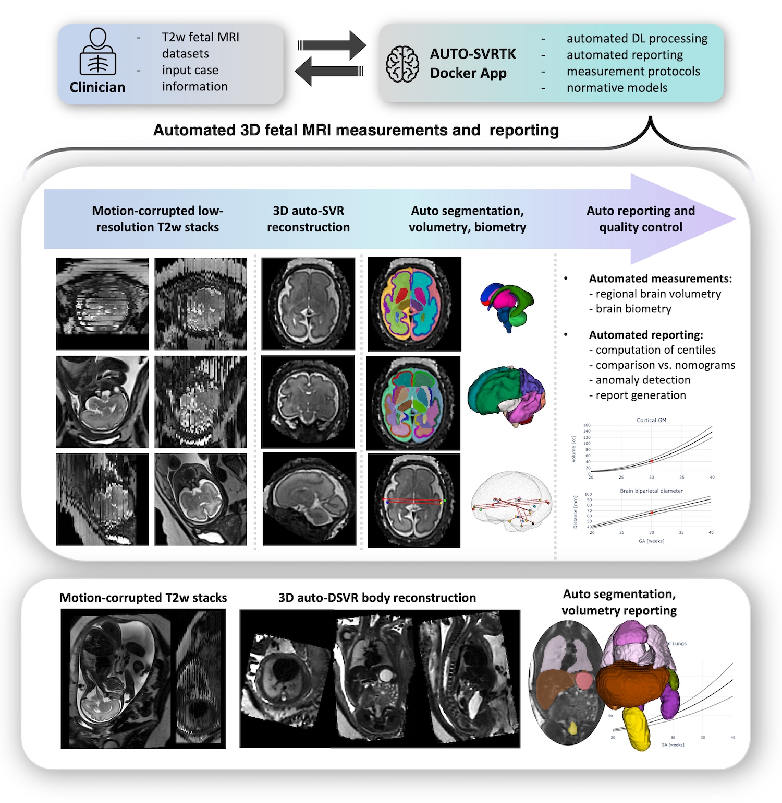
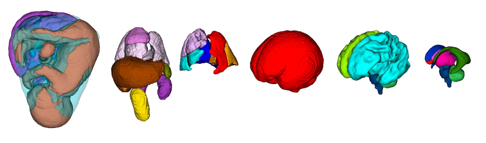
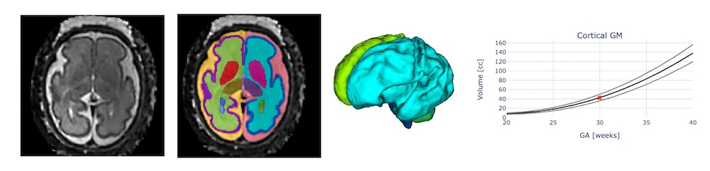
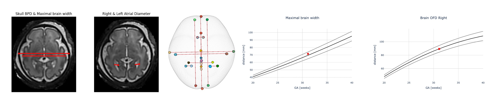

Scripts for automated SVRTK processing dockers 
====================

This repository contains the pipelines for [MONAI](https://github.com/Project-MONAI/MONAI)-based automated fetal MRI analysis [SVRTK dockers](https://hub.docker.com/r/fetalsvrtk/svrtk).


- The repository and code for automation of [SVR](https://github.com/SVRTK/SVRTK) reconstruction and deep learning segmentation were designed and created by [Alena Uus](https://github.com/alenauus), Kings' College London.

- Please email alena.uus (at) kcl.ac.uk if in case of any questions.





**The auto pipelines are used in:**

- Scanner integration via AIDE led by [Tom Roberts](https://github.com/tomaroberts): https://github.com/SVRTK/aide-svrtk

- Scanner integration via Gadgetron led by [Sara Neves Silva](https://github.com/saranevessilva): https://github.com/SVRTK/gadgetron-svrtk-integration
  
- FetPype framework for reconstruction, segmentation and surface generation: https://github.com/fetpype/fetpype


Development of SVRTK was supported by projects led by Prof Mary Rutherford, Dr Lisa Story, Dr Maria Deprez, Dr Jana Hutter and Prof Jo Hajnal.

Optimisation of the docker environment is supported by [Joshua van Amerom](https://github.com/jfpva). 


Auto processing 
---------------


**The automated SVRTK docker tags are _fetalsvrtk/svrtk:general_auto_amd_ OR _fetalsvrtk/svrtk:general_auto_arm_ (M1 chip)**


**AUTOMATED 3D T2w BRAIN / BODY RECONSTRUCTION:**

*Input data requirements:*
- more than 5-6 stacks
- full ROI coverage in all stacks
- 21-40 weeks GA
- no extreme shading artifacts
- singleton pregnancy
- 0.55 / 1.5 / 3T
- 80 – 180ms TE
- sufficient SNR and image quality

*Output:*
- 0.8mm resolution (or as specified)
- Standard radiological space

```bash

docker pull fetalsvrtk/svrtk:general_auto_amd

#auto brain reconstruction
docker run --rm  --mount type=bind,source=LOCATION_ON_YOUR_MACHINE,target=/home/data  fetalsvrtk/svrtk:general_auto_amd sh -c ' bash /home/auto-proc-svrtk/scripts/auto-brain-reconstruction.sh /home/data/folder-with-files /home/data/out-brain-recon-results 1 3.0 0.8 1 ; ' 

#auto body reconstruction
docker run --rm  --mount type=bind,source=LOCATION_ON_YOUR_MACHINE,target=/home/data  fetalsvrtk/svrtk:general_auto_amd sh -c ' bash /home/auto-proc-svrtk/scripts/auto-body-reconstruction.sh /home/data/folder-with-files /home/data/out-body-recon-results 1 3.0 0.8 1 ; '

#auto thorax reconstruction
docker run --rm  --mount type=bind,source=LOCATION_ON_YOUR_MACHINE,target=/home/data  fetalsvrtk/svrtk:general_auto_amd sh -c ' bash /home/auto-proc-svrtk/scripts/auto-thorax-reconstruction.sh /home/data/folder-with-files /home/data/out-thorax-recon-results 1 3.0 0.8 1 ; '

#auto body reconstruction for CDH
docker run --rm  --mount type=bind,source=LOCATION_ON_YOUR_MACHINE,target=/home/data  fetalsvrtk/svrtk:general_auto_amd sh -c ' bash /home/auto-proc-svrtk/scripts/auto-body-reconstruction-cdh.sh /home/data/folder-with-files /home/data/out-body-recon-results 0 3.0 0.8 1 ; '

#auto head reconstruction
docker run --rm  --mount type=bind,source=LOCATION_ON_YOUR_MACHINE,target=/home/data  fetalsvrtk/svrtk:general_auto_amd sh -c ' bash /home/auto-proc-svrtk/scripts/auto-head-reconstruction.sh /home/data/folder-with-files /home/data/out-head-recon-results 0 3.0 0.8 1 ; '

```

**0.55T low field reconstruction options:**

```bash

#0.55T auto brain reconstruction
docker run --rm  --mount type=bind,source=LOCATION_ON_YOUR_MACHINE,target=/home/data  fetalsvrtk/svrtk:general_auto_amd sh -c ' bash /home/auto-proc-svrtk/scripts/auto-brain-055t-reconstruction.sh /home/data/folder-with-files /home/data/out-brain-recon-results 1 4.5 1.0 1 ; ' 

#0.55T auto body reconstruction
docker run --rm  --mount type=bind,source=LOCATION_ON_YOUR_MACHINE,target=/home/data  fetalsvrtk/svrtk:general_auto_amd sh -c ' bash /home/auto-proc-svrtk/scripts/auto-body-055t-reconstruction.sh /home/data/folder-with-files /home/data/out-body-recon-results 1 4.5 1.0 1 ; '

```


**Semi-automated reconstruction options (with manual mask & template initialisation):**

```bash

#semi-manual brain reconstruction
docker run --rm  --mount type=bind,source=LOCATION_ON_YOUR_MACHINE,target=/home/data  fetalsvrtk/svrtk:general_auto_amd sh -c ' bash /home/auto-proc-svrtk/scripts/semi-manual-brain-reconstruction.sh /home/data/folder-with-files /home/data/out-brain-recon-results /home/data/template-stack.nii.gz /home/data/template-brain-mask.nii.gz  1 4.5 1.0 1 ; ' 

#semi-manual body reconstruction
docker run --rm  --mount type=bind,source=LOCATION_ON_YOUR_MACHINE,target=/home/data  fetalsvrtk/svrtk:general_auto_amd sh -c ' bash /home/auto-proc-svrtk/scripts/semi-manual-auto-body-reconstruction.sh /home/data/folder-with-files /home/data/out-body-recon-results  /home/data/template-stack.nii.gz /home/data/template-brain-mask.nii.gz  1 4.5 1.0 1 ; '

```


**AUTOMATED 3D T2w BRAIN / BODY / ... SEGMENTATION:**




*Input data requirements:*
- sufficient SNR and image quality
- full ROI coverage
- good quality 3D SVR / DSVR reconsruction
- reorientation to the standard radiological atlas space
- 20-38 weeks GA
- no extreme shading artifacts
- no extreme structural anomalies
- 0.55 / 1.5 / 3T
- 80 – 250ms TE

_Note: please use general_auto_arm tag for M1 Mac computers._

```bash

docker pull fetalsvrtk/svrtk:general_auto_amd

#auto brain tissue segmentation
docker run --rm  --mount type=bind,source=LOCATION_ON_YOUR_MACHINE,target=/home/data  fetalsvrtk/svrtk:general_auto_amd sh -c ' bash /home/auto-proc-svrtk/scripts/auto-brain-bounti-segmentation-fetal.sh /home/data/your_folder_with_brain_svr_t2_files  /home/data/output_folder_for_segmentations ; '

#auto brain extraction
docker run --rm  --mount type=bind,source=LOCATION_ON_YOUR_MACHINE,target=/home/data  fetalsvrtk/svrtk:general_auto_amd sh -c ' bash /home/auto-proc-svrtk/scripts/auto-brain-bet-segmentation-fetal.sh /home/data/your_folder_with_brain_svr_t2_files  /home/data/output_folder_for_segmentations ; '

#auto body organ segmentation
docker run --rm  --mount type=bind,source=LOCATION_ON_YOUR_MACHINE,target=/home/data  fetalsvrtk/svrtk:general_auto_amd sh -c ' bash /home/auto-proc-svrtk/scripts/auto-body-organ-segmentation.sh /home/data/your_folder_with_body_dsvr_t2_files  /home/data/output_folder_for_segmentations ; '

#auto lung segmentation (normal and CDH)
docker run --rm  --mount type=bind,source=LOCATION_ON_YOUR_MACHINE,target=/home/data  fetalsvrtk/svrtk:general_auto_amd sh -c ' bash /home/auto-proc-svrtk/scripts/auto-lung-segmentation.sh /home/data/your_folder_with_body_dsvr_t2_files  /home/data/output_folder_for_segmentations ; ' 

#auto face/head segmentation
docker run --rm  --mount type=bind,source=LOCATION_ON_YOUR_MACHINE,target=/home/data  fetalsvrtk/svrtk:general_auto_amd sh -c ' bash /home/auto-proc-svrtk/scripts/auto-face-segmentation-fetal.sh /home/data/your_folder_with_head_svr_t2_files  /home/data/output_folder_for_segmentations ; '

```

**AUTOMATED REORIENTATION OF 3D T2w BRAIN / BODY / THORAX RECONS TO STANDARD SPACE:**


*Input data requirements:*
- sufficient SNR and image quality
- full ROI coverage
- no extreme shading artifacts
- no extreme structural anomalies
- 0.55 / 1.5 / 3T
- 80 – 250ms TE

_Note: please use general_auto_arm tag for M1 Mac computers._

```bash

docker pull fetalsvrtk/svrtk:general_auto_amd

#auto brain reorientation to the standard space 
docker run --rm  --mount type=bind,source=LOCATION_ON_YOUR_MACHINE,target=/home/data  fetalsvrtk/svrtk:general_auto_amd sh -c ' bash /home/auto-proc-svrtk/scripts/auto-brain-reorientation.sh /home/data/your_folder_with_brain_svr_t2_files  /home/data/output_folder_for_reoriented_images 0.5 1 0; '

#auto body reorientation to the standard space 
docker run --rm  --mount type=bind,source=LOCATION_ON_YOUR_MACHINE,target=/home/data  fetalsvrtk/svrtk:general_auto_amd sh -c ' bash /home/auto-proc-svrtk/scripts/auto-body-reorientation.sh /home/data/your_folder_with_body_dsvr_t2_files  /home/data/output_folder_for_reoriented_images 0.5 1 0; '

#auto thorax reorientation to the standard space 
docker run --rm  --mount type=bind,source=LOCATION_ON_YOUR_MACHINE,target=/home/data  fetalsvrtk/svrtk:general_auto_amd sh -c ' bash /home/auto-proc-svrtk/scripts/auto-thorax-reorientation.sh /home/data/your_folder_with_thorax_dsvr_t2_files  /home/data/output_folder_for_reoriented_images 0.5 1 0; '

#auto body reorientation for CDH cases to the standard space 
docker run --rm  --mount type=bind,source=LOCATION_ON_YOUR_MACHINE,target=/home/data  fetalsvrtk/svrtk:general_auto_amd sh -c ' bash /home/auto-proc-svrtk/scripts/auto-body-reorientation-cdh.sh /home/data/your_folder_with_body_cdh_dsvr_t2_files  /home/data/output_folder_for_reoriented_images 0.5 1 0; '

```


**AUTOMATED VOLUMETRY REPORTING FOR 3D T2w BRAIN / LUNGS / ... SEGMENTATIONS:**


*Input data requirements:*
- reconstructed 3D body / brain images (after QC)
- corresponding segmentations (after QC)
- case GA

- _Note: please use general_auto_arm tag for M1 Mac computers._



```bash

docker pull fetalsvrtk/svrtk:general_auto_amd

#brain tissue volumetry reporting 
docker run --rm  --mount type=bind,source=LOCATION_ON_YOUR_MACHINE,target=/home/data  fetalsvrtk/svrtk:general_auto_amd sh -c ' python3 /home/auto-proc-svrtk/scripts/auto-reporting-brain-volumetry-html.py CASE_ID 28.14 DATE /home/data/vol-test/brain-svr-file.nii.gz /home/data/brain-tissue-segmenation-file.nii.gz /home/data/name-for-volumetry-report.html ; chmod 777 /home/data/name-for-volumetry-report.html  '

#lung volumetry reporting 
docker run --rm  --mount type=bind,source=LOCATION_ON_YOUR_MACHINE,target=/home/data  fetalsvrtk/svrtk:general_auto_amd sh -c ' python3 /home/auto-proc-svrtk/scripts/auto-reporting-lung-volumetry-html.py CASE_ID 28.14 DATE /home/data/vol-test/body-svr-file.nii.gz /home/data/lung-lobe-segmenation-file.nii.gz /home/data/name-for-volumetry-report.html ; chmod 777 /home/data/name-for-volumetry-report.html  '


```


**AUTOMATED BIOMETRY REPORTING FOR 3D T2w BRAIN RECONSTRUCTIONS:**


*Input data requirements:*
- 20-40 weeks GA
- no extreme structural anomalies
- reconstructed 3D brain image (after QC)
- corresponding brain BOUNTI tissue segmentation (after QC)
- sufficient image quality

- case GA

- _Note: please use general_auto_arm tag for M1 Mac computers._



```bash

docker pull fetalsvrtk/svrtk:general_auto_amd

#brain biometry
docker run --rm  --mount type=bind,source=LOCATION_ON_YOUR_MACHINE,target=/home/data  fetalsvrtk/svrtk:general_auto_amd sh -c ' bash /home/auto-proc-svrtk/scripts/auto-brain-biometry-fix.sh CASE_ID CASE_GA(e.g., 30.14) /home/data/test-bio/org-t2w-svr.nii.gz /home/data/test-bio/bounti-label-for-t2w-svr.nii.gz /home/data/test-bio/out-res-reo-t2w-svr.nii.gz /home/data/test-bio/out-res-reo-bounti-label.nii.gz /home/data/test-bio/out-reo-transform.dof /home/data/test-bio/out-res-reo-bio-lab.nii.gz /home/data/test-bio/out-bio.csv /home/data/test-bio/out-bio-report.html ; '

#additional brain biometry reporting of precomputed biometry outputs
docker run --rm  --mount type=bind,source=LOCATION_ON_YOUR_MACHINE,target=/home/data  fetalsvrtk/svrtk:general_auto_amd sh -c ' python3 /home/auto-proc-svrtk/scripts/auto-reporting-brain-biometry.py CASE_ID 28.14 DATE /home/data/test-bio/out-res-reo-t2w-svr.nii.gz /home/data/test-bio/out-res-reo-bio-lab.nii.gz  /home/data/test-bio/out-bio-report.html ; chmod 777 /home/data/test-bio/out-bio-report.html ;  '


```


License
-------

The auto SVRTK code and all scripts are distributed under the terms of the
[GNU General Public License v3.0](https://www.gnu.org/licenses/gpl-3.0.en.html). This program is free software: you can redistribute it and/or modify it under the terms of the GNU General Public License as published by the Free Software Foundation version 3 of the License. 

This software is distributed in the hope that it will be useful, but WITHOUT ANY WARRANTY; without even the implied warranty of MERCHANTABILITY or FITNESS FOR A PARTICULAR PURPOSE.  See the GNU General Public License for more details.


Citation and acknowledgements
-----------------------------

In case you found auto SVRTK useful please give appropriate credit to the software and [SVRTK dockers](https://hub.docker.com/r/fetalsvrtk/svrtk).

**Auto brain reconstruction (please include both citations):**
> Uus, A., Neves Silva, S., Aviles Verdera, J., Payette, K., Hall, M., Colford, K., Luis, A., Sousa, H., Ning, Z., Roberts, T., McElroy, S., Deprez, M., Hajnal, J., Rutherford, M., Story, L., & Hutter, J. (2025). Scanner-based real-time three-dimensional brain + body slice-to-volume reconstruction for T2-weighted 0.55-T low-field fetal magnetic resonance imaging. Pediatric Radiology, 55(3), 556–569. https://doi.org/10.1007/s00247-025-06165-x

> Kuklisova-Murgasova, M., Quaghebeur, G., Rutherford, M. A., Hajnal, J. V., & Schnabel, J. A. (2012). Reconstruction of fetal brain MRI with intensity matching and complete outlier removal. Medical Image Analysis, 16(8), 1550–1564.: https://doi.org/10.1016/j.media.2012.07.004

**Auto thorax/body reconstruction (please include both citations):**
> Uus, A., Neves Silva, S., Aviles Verdera, J., Payette, K., Hall, M., Colford, K., Luis, A., Sousa, H., Ning, Z., Roberts, T., McElroy, S., Deprez, M., Hajnal, J., Rutherford, M., Story, L., & Hutter, J. (2025). Scanner-based real-time three-dimensional brain + body slice-to-volume reconstruction for T2-weighted 0.55-T low-field fetal magnetic resonance imaging. Pediatric Radiology, 55(3), 556–569. https://doi.org/10.1007/s00247-025-06165-x

> Uus, A., Zhang, T., Jackson, L., Roberts, T., Rutherford, M., Hajnal, J.V., Deprez, M. (2020). Deformable Slice-to-Volume Registration for Motion Correction in Fetal Body MRI and Placenta. IEEE Transactions on Medical Imaging, 39(9), 2750-2759: http://dx.doi.org/10.1109/TMI.2020.2974844

**Brain biometry:**
> Luis, A., Uus, A., Matthew, J., Arulkumaran, S., Collado, A. E., Kyriakopoulou, V., Silva, S. N., Verdera, J. A., Hall, M., Bansal, S., McElroy, S., Colford, K., Hajnal, J. v, Hutter, J., Story, L., & Rutherford, M. (2025). Towards automated fetal brain biometry reporting for 3-dimensional T2-weighted 0.55-3T magnetic resonance imaging at 20-40 weeks gestational age range. MedRxiv, 2025.02.06.25321808. https://doi.org/10.1101/2025.02.06.25321808

**Brain tissue segmentation:**
> Uus, A. U., Kyriakopoulou, V., Makropoulos, A., Fukami-Gartner, A., Cromb, D., Davidson, A., Cordero-Grande, L., Price, A. N., Grigorescu, I., Williams, L. Z. J., Robinson, E. C., Lloyd, D., Pushparajah, K., Story, L., Hutter, J., Counsell, S. J., Edwards, A. D., Rutherford, M. A., Hajnal, J. V., Deprez, M. (2023) BOUNTI: Brain vOlumetry and aUtomated parcellatioN for 3D feTal MRI. eLife 12:RP88818; doi: https://doi.org/10.7554/eLife.88818.1

**Body organ segmentation:**
> Uus, A. U., Hall, M., Grigorescu, I., Avena Zampieri, C., Egloff Collado, A., Payette, K., Matthew, J., Kyriakopoulou, V., Hajnal, J. V., Hutter, J., Rutherford, M. A., Deprez, M., Story, L. (2024) Automated body organ segmentation, volumetry and population-averaged atlas for 3D motion-corrected T2-weighted fetal body MRI. Sci Rep 14, 6637; doi: https://doi.org/10.1038/s41598-024-57087-x

**Lung segmentation:**
> Uus, A., Avena Zampieri, C., Downes, F., Egloff Collado, A., Hall, M., Davidson, J. R., Payette, K., Aviles Verdera, J., Grigorescu, I., Hajnal, J., Deprez, M., Aertsen, M., Hutter, J., Rutherford, M., Deprest, J. & Story, L., (2024). Towards automated multi-regional lung parcellation for 0.55-3T 3D T2w fetal MRI. PIPPI MICCAI Workshop 2024. LNCS vol 14747. https://doi.org/10.1007/978-3-031-73260-7_11

**Face segmentation:**
> Matthew, J., Uus, A., de Souza, L., Wright, R., Fukami-Gartner, A., Priego, G., Saija, C., Deprez, M., Collado, A. E., Hutter, J., Story, L., Malamateniou, C., Rhode, K., Hajnal, J., & Rutherford, M. A. (2024). Craniofacial phenotyping with fetal MRI: a feasibility study of 3D visualisation, segmentation, surface-rendered and physical models. BMC Medical Imaging, 24(1), 52. https://doi.org/10.1186/s12880-024-01230-7

**Brain biometry:**
> Luis, A., Uus, A., Matthew, J., Arulkumaran, S., Collado, A. E., Kyriakopoulou, V., Silva, S. N., Verdera, J. A., Hall, M., Bansal, S., McElroy, S., Colford, K., Hajnal, J. v, Hutter, J., Story, L., & Rutherford, M. (2025). Towards automated fetal brain biometry reporting for 3-dimensional T2-weighted 0.55-3T magnetic resonance imaging at 20-40 weeks gestational age range. MedRxiv, 2025.02.06.25321808. https://doi.org/10.1101/2025.02.06.25321808

**Auto brain reorientation:**
> Uus, A. U., Hall, M., Payette, K., Hajnal, J. V., Deprez, M., Hutter, J., Rutherford, M. A., Story, L. (2023) Combined quantitative T2* map and structural T2- weighted tissue-specific analysis for fetal brain MRI: pilot automated pipeline. PIPPI MICCAI 2023 workshop, LNCS 14246.: https://doi.org/10.1007/978-3-031-45544-5_3

**Auto thorax/body reorientation:**
> Uus, A., Grigorescu, I., van Poppel, M., Steinweg, J. K., Roberts, T., Rutherford, M., Hajnal, J., Lloyd, D., Pushparajah, K. & Deprez, M. (2022) Automated 3D reconstruction of the fetal thorax in the standard atlas space from motion-corrupted MRI stacks for 21-36 weeks GA range. Medical Image Analysis, 80 (August 2022).: https://doi.org/10.1016/j.media.2022.102484


Disclaimer
-------

This software has been developed for research purposes only, and hence should not be used as a diagnostic tool. In no event shall the authors or distributors be liable to any direct, indirect, special, incidental, or consequential damages arising of the use of this software, its documentation, or any derivatives thereof, even if the authors have been advised of the possibility of such damage.

